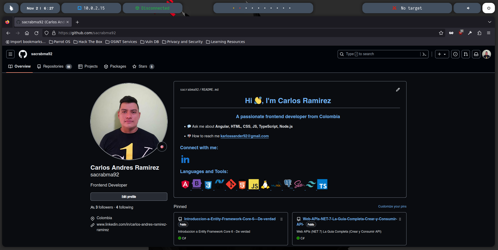
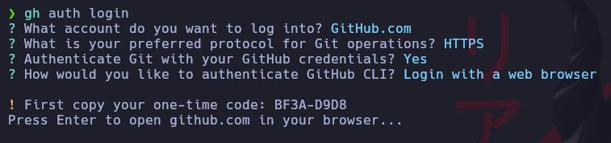

# Configuración inicial de GitHub

```
git config --global user.name "Carlos Ramirez"
git config --global user.email "karlossander92@gmail.com"
```
Configuración inicial del usuario y del email


Ahora nos atenticaremos en el navegador con nuestro perfil de GitHub


Una vez autenticados vamos a escribir por linea de comandos el siguiente comando para realizar la atenticacion desde  nuestra consolo y que nos habra el navegador web
```
gh auth login
```

