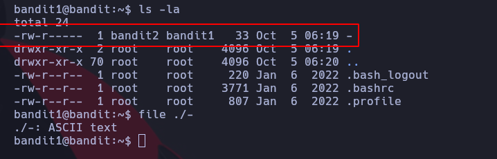
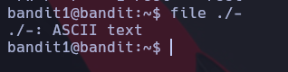
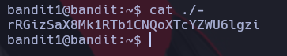

# Bandit 1

Listamos los archivos ocultos y vemos que hay un archivo especial "-"

Vamos a mirar que tipo de archivo se trata "-" para eso es necesario escapar el arhcivo con ./- \
usamos el comando file para averiguar que tipo de archivo es:

Como vemos que es un archivo de tipo ASCII Text podemos abrirlo con la herramienta cat

