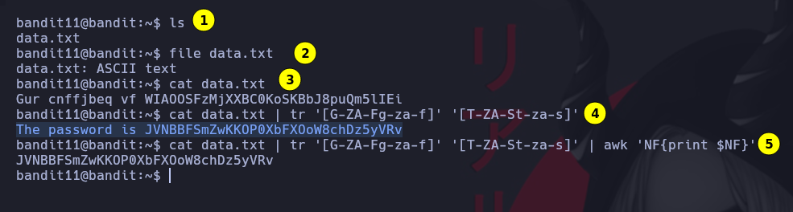

# Bandit 11

La contraseña esta almacenada en un archivo data.txt y todas las letras en minusculas y mayusculas estan rotadas.\

\

# 1
Listamos los archivos
# 2
Miramos que formato tiene el archivo
# 3
Procedemos a leer el contenido
# 4
Rotamos las letras en este caso 13 posiciones
# 5
Obtenemos el ultimo argumento
