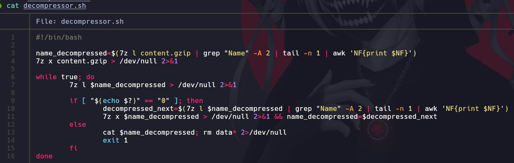

# Bandit 12

La contraseña para el siguiente nivel se almacena en el archivo data.txt, que es un hexdump de un archivo que ha sido comprimido repetidamente. Para este nivel puede ser útil crear un directorio bajo /tmp en el que puedas trabajar usando mkdir. Por ejemplo: mkdir /tmp/myname123. Luego copie el archivo de datos usando cp, y renómbrelo usando mv (¡lea las páginas de manual!)

\

Codigo fuente en el archivo de compressor.sh
