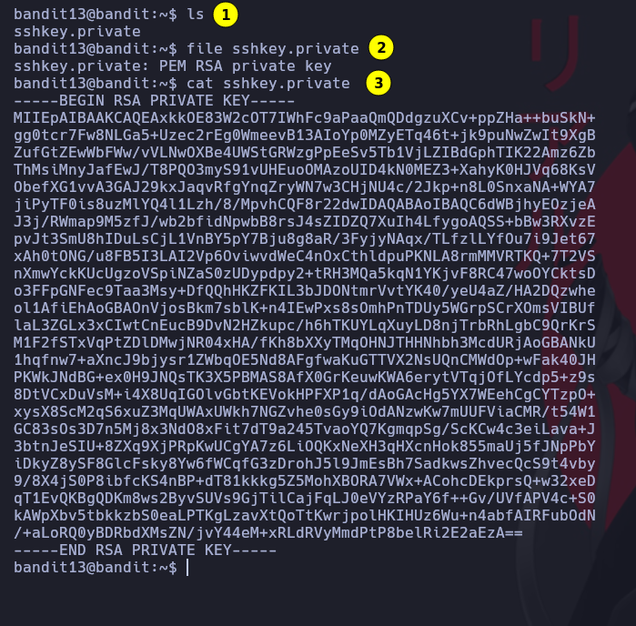
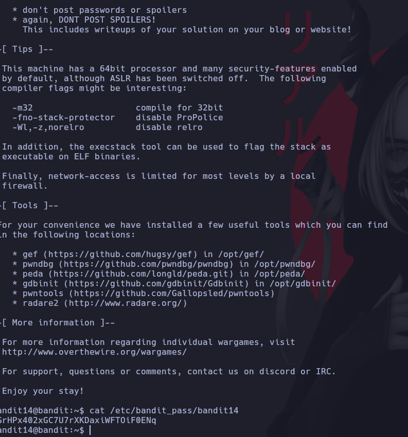

# Bandit 13

La contraseña para el siguiente nivel se almacena en **/etc/bandit_pass/bandit14 y sólo puede ser leída por el usuario bandit14.** Para este nivel, no obtienes la siguiente contraseña, pero obtienes una clave SSH privada que puede ser usada para iniciar sesión en el siguiente nivel. **Nota: localhost es un nombre de host que se refiere a la máquina en la que estás trabajando.**

Como podemos observar es un archivo **RSA private key** nos indica que debemos conectarnos con esta llave privada a Bandit14 para poder observar la contraseña.

```
 ssh -i sshkey.private bandit14@localhost -p 2220
```

Como podemos observar el comando, tenemos que conoectarnos con el archivo que es una clave a bandit14@localhost en el puerto 2220.


