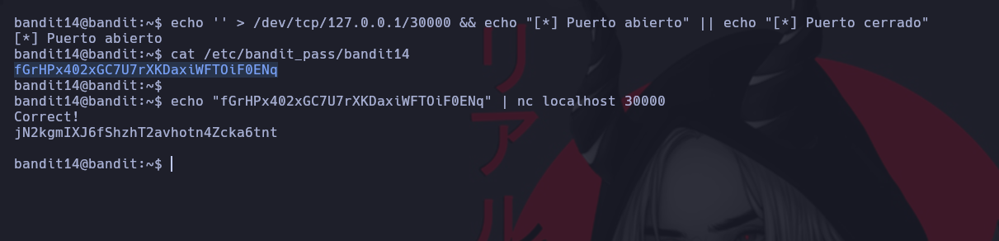

# Bandit 14

La contraseña para el siguiente nivel se puede recuperar enviando la contraseña del nivel actual al puerto 30000 en localhost. \

Vamos a revisar si el puerto esta abierto. Enviaremos una cadena vacia al puerto 30000. Si esta abierto colocamos **[\*] Puerto abierto**, sino **[\*] Puerto cerrado.**

En esta ocación esta abierto asi que veremos nuestra contraseña actual en el archivo /etc/bandit_pass/bandit14; la copiamos y la enviaremos a una conexión por netcat a nuestra ip local por el puerto 30000.\
Y nos devolvera la contraseña del siguiente nivel.
