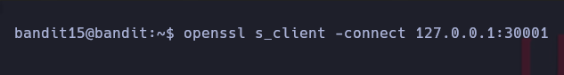
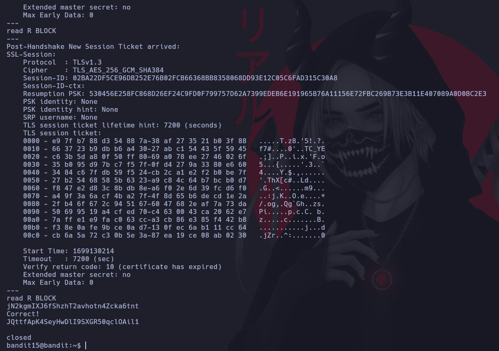

# Bandit 15

La contraseña para el siguiente nivel se puede recuperar enviando la contraseña del nivel actual al puerto 30001 en localhost utilizando encriptación SSL.

Entablamos una conexión con openssl como cliente a la maquina local por el puerto 30001.

Como podemos observar esta cifrada la conexion y en la parte de abajo proporcionamos la contraseña actual y al presionar Enter nos devolvera la del siguiente nivel.

