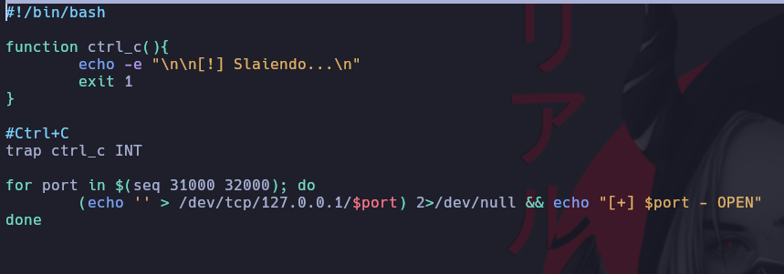
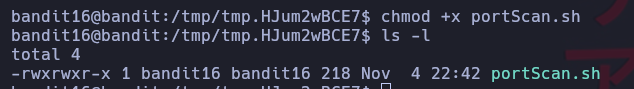
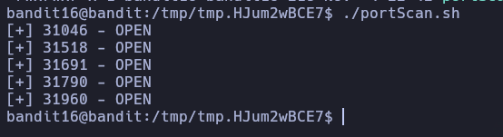
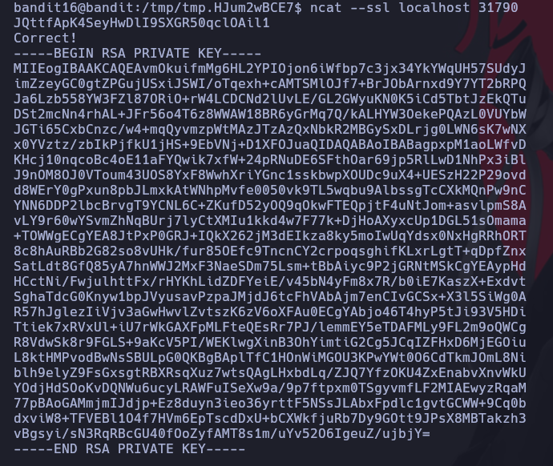
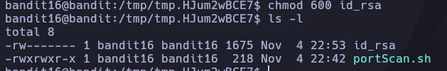

# Bandit 16

Las credenciales para el siguiente nivel se pueden recuperar enviando la contraseña del nivel actual a un puerto en localhost en el rango 31000 a 32000. Primero averigua cuáles de estos puertos tienen un servidor escuchando en ellos. Luego averigua cuáles de ellos hablan SSL y cuáles no. Sólo hay 1 servidor que dará las siguientes credenciales, los demás simplemente te devolverán lo que le envíes.\

Creamos una carpeta temporal con el comando.
```
mktemp -d
```
Eh ingresamos a la carpeta temporal.

Creamos un codigo para **Scanear puertos**

Le damos permisos de ejecución\
\
Corremos el comando\
\
Conectamos por medio de necat con certificado SSL en local y en uno de los puertos. Vemos que nos arroja una RSA.\
La copiamos y creamos un archivo en este caso se llama id_rsa y pegamos el contenido.\
\
Le damos permisos 600 que es que el usuario propietario permita ejecutar ese archivo\
\
Con el arhivo id_rsa podemos realizar una conexión a localhost por el puerto 2220y le damos que [yes]\
Pegamos el password de Bandit 15 y BOMM! conectamos a bandit 17.\
Vemos el archivo que esta en la ruta /dev/bandit_pass/bandit17
