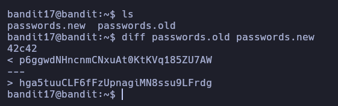

# Bandit 17

Hay 2 archivos en el homedirectory: passwords.old y passwords.new. La contraseña para el siguiente nivel está en passwords.new y es la única línea que ha cambiado entre passwords.old y passwords.new.

Listamos los archivos y vemos que hay dos.\
Con el comando diff lo que hace es comparar el contenido de los dos archivos y muestra en que parte son diferentes.\
Vemos que la contraseña esta en la parte de abajo\

