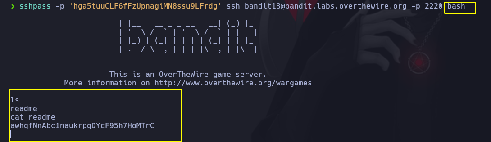

# Bandit 18

La contraseña para el siguiente nivel se almacena en un archivo readme en el homedirectory. Desafortunadamente, alguien ha modificado .bashrc para cerrar la sesión cuando te conectas con SSH.

Cuando tratamos de conectar a la maquina colocamos **bash** al final para poder conectarnos a una consola.\
Luego listamos los archivos y vemos  un readme y le hacemos un cat

