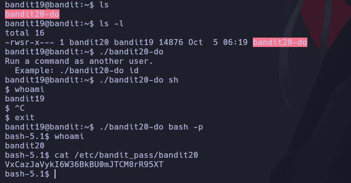

# Bantid 19

Para acceder al siguiente nivel, debe utilizar el binario setuid en el directorio home. Ejecútalo sin argumentos para saber cómo usarlo. La contraseña para este nivel se puede encontrar en el lugar habitual (/etc/bandit_pass), después de haber utilizado el binario setuid.

Le hacemos un ls para ver los archivos, despues ejecutamos el binario y vemos que podemos agregar otro parametro. Asi que aprovechamos para ver si con sh o bas quien tiene el bandit20.

