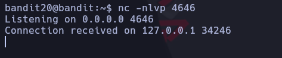
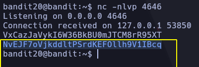

# Bandit 20

Hay un binario setuid en el homedirectoriy que hace lo siguiente: establece una conexión con localhost en el puerto que especifiques como argumento en la línea de comandos. Luego lee una línea de texto de la conexión y la compara con la contraseña del nivel anterior (bandit20). Si la contraseña es correcta, transmitirá la contraseña para el siguiente nivel (bandit21).

En esta ocación toca abrir dos terminales al mismo servidor. En una de ellas realizamos un netcat por el puerto 4646.
\
Desde la otra realizamos la conexión al puerto 4646\

