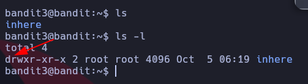
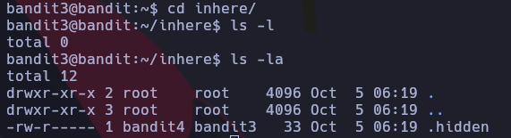
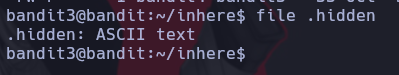
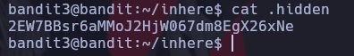

# Bandit 3

Listamos los archivos con sus atributos y permisos con el comando -l y en este caso vemos que tenemos un directorios, lo podemos identificar porque al principio tiene una letra d \
 \

Accedemos al directorio con el comando cd + el nombre del directorio \
O podemos listar sin necesidad de entrar con el comando ls \
 \
Vemos que hay un archivo oculto llamado.hidden procedemos a mirar que tipo de archivo es con el comando file \
 \
Es un archivo de texto leguible procedemos a usar el comando cat para poder leerlo \


# Otra forma de buscar el archivo

```
find . -name .hidden | xargs cat
``` \
Buscame un archivo en el directorio actual que se llame .hidden y aplicale un cat para ver el contenido \

