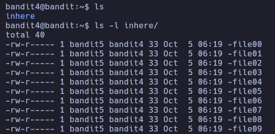
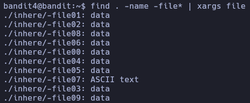
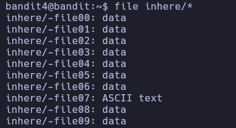

# Bandit 4

Necesitamos buscar un archivo que es legible \

Empezamos listando y encontramos un directorio, procedemos seguir listando lo que contiene la carpeta. Vemos que la carpeta que tiene varios archivos \



Procedemos a buscar un archivo que sea legible \
Buscamos desde la ruta actual archivos que tenga file y despues puede ir cualquier cosa, luego procedemos a mirar que tipo de archivo es cada uno de los encontrados \
```
find . -name -file* | xargs file
```


Otra forma de buscar y listar por tipo de archivos

```
file inhere/*
```


Como ya vimos que el file07 es de texto procedemos a ver el contenido una forma de verlo es: \
Buscamos en la ruta actual por nombre que sela file07 y despues procedemos a realizar un cat para ver el contenido \
```
find . -name -file07 | xargs cat
```

Hazme un cat al comando ejecutado a nivel de sistema \
```
cat $(find . -name -file07)
```
