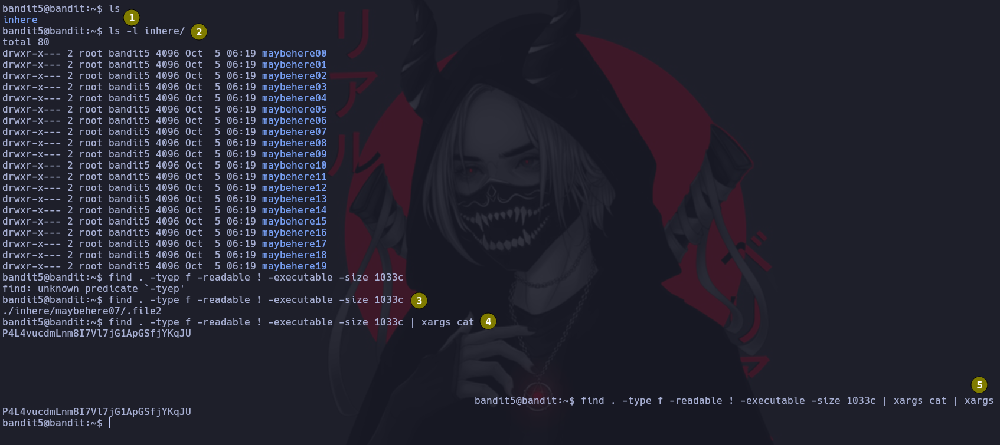

# Bandit 5

La contraseña esta almacenada un un fichero dentro del directorio inhere y tiene las siguientes caracteristicas:

Humanamente legible \
Pesa 1033 bytes \
No es ejecutable 


## 1
Comenzamos listando el contenido de la ruta actual

## 2
Como vamos que tenemos una carpeta procedemos a listar el contenido con sus propiedades como vemos que hay demaciados archivos y carpetas procedemos a "filtrar" por las caracteristicas arriba mensionadas

## 3
Buscar un archivo en el directorio actual que sea humanamente legible, que no sea un ejecutable y que pese 1033 bytes. Nos encuentra un fichero con esas caracteristicas
```
find . -type f -readable ! -executable -size 1033c
```

## 4
Miramos que contiene el archivo, pero vemos que se daña. 
```
find . -type f -readable ! -executable -size 1033c | xargs cat
```

## 5
Aplicamos al final un xargs que pueda restaurar la salida de cat
```
find . -type f -readable ! -executable -size 1033c | xargs cat | xargs
```
