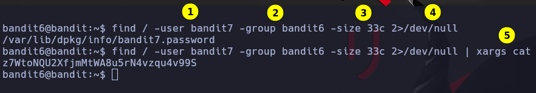

# Bandit 6

\
**find /** Buscamos desde la raiz\
**-user bandit7** El archivo debe pertenecer al usuario bandit7\
**-group bandit6** El ficheque debe pertenecer al grupo bandit6\
**-size 33c** El fichero debe pesar 33 bytes\
**2>/dev/null** Los errores envielos al /dev/null\
**xargs cat** Lo que encuentre muestrelo con cat\
