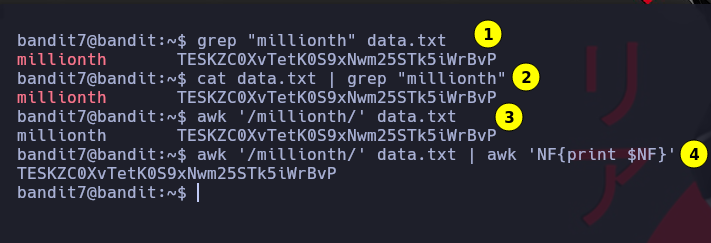

# Bandit 7

El password para el siguiente nivel esta almacenado en un archivo **data.txt** junto con la palabra **millionth**


Grepeamos la palabra millionth en el archivo data.txt\
**1** Una de las formas de hacerlos es por medio de
```
grep "millionth" data.txt
```
**2** Otra forma de hacer la busqueda en el fichero es
```
cat data.txt | grep "millionth"
```
**3** Otra forma buscar seria:
```
awk '/millionth/' data.txt
```
**4** Obtenemos un resultados con dos valores distitnos 1 a la izquierda y el otro a la derecha. Para quedarnos solamente con el que nos interesa el de la derecha hacemos un:
```
awk 'NF{print $NF}'
```
