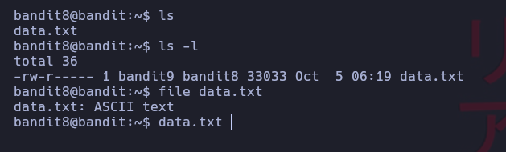
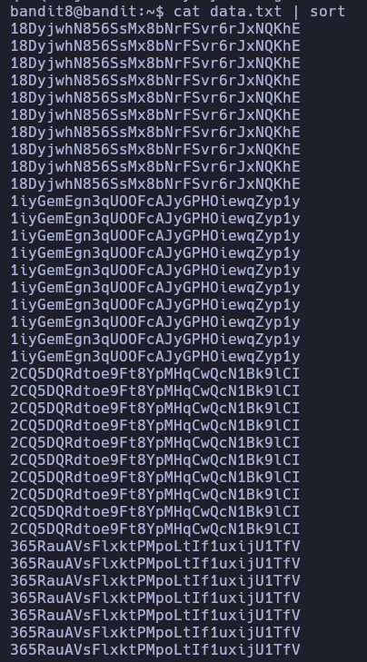
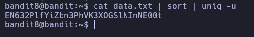

# Bandit 8

La contraseña esta almacenada en un fichero data.txt y es la linea de texto que no esta repetida. \
Listamos el contenido de la carpeta

Vamos ver el archivo y a organizarlo con el comando sort. Si nos fijamos las lineas se encuentran repetidas.

Asi que vamos a buscar por lineas que sean unicas

Obtenemos la clave

