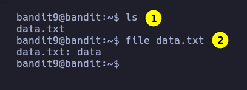
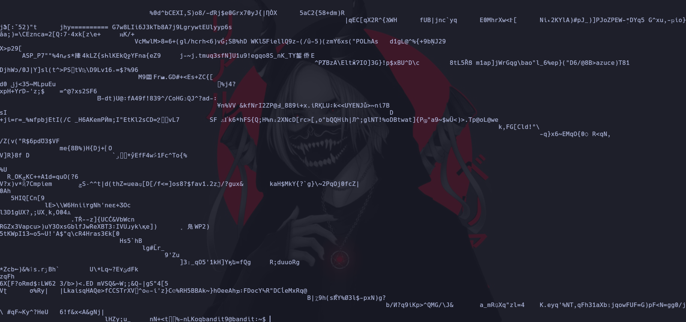
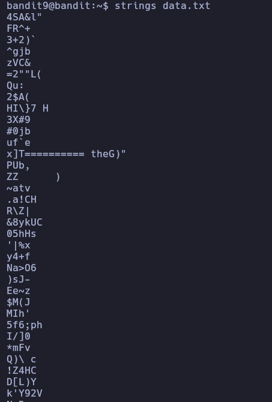
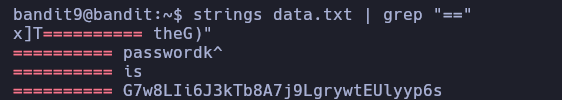
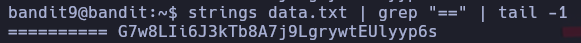
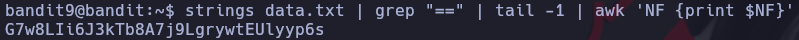

# Bandit 9

El password del siguiente nivel estan en un archivo data.txt y lo preceden varios caracteres '='

# 1 
Listamos el contenido de la carpeta y vemos que dice data.txt
# 2
Para asegurarnos que es un archivo .txt verificamos con el comando file. Y vemos que es un binario
\
Si tratamos a abrir el archivo que vemos que es un binario nos va a arrojar todos estos caracteres no legible.\
\
Para poder listar los caracteres legibles usamos el comando strings\
\
Para poder filtrar por los caracteres "=" usamos el grep. Como podemos observar hay 4 lineas que coinciden con los "="\
\
Como observamos que la cadena esta en la ultima linea podemos filtrar con el comando tail\
\
En este caso como queremos los caracteres de la derecha tomamos el ultimo valor\

