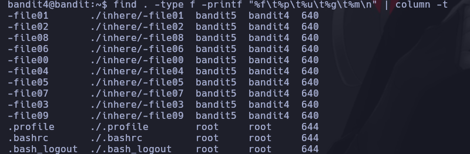

# Comandos o notas extras

## Comando a nivel de sistema
Comando aplicado a nivel de sistema se escribre a dentro de: $() \

## Archivos con espacios
Para poder seleccionar un archivo que tiene espacios se puede encerrar en dobles comillas "" o se puede escapar el spacio con \\ \

## Comando que busca un archivo por variables
```
find . -type f -printf "%f\t%p\t%u\t%g\t%m\n | column -t
```
**%f** -> Archivos \
**%p** -> Ruta absoluta '
**%u** -> El usuario propietario del archivo \
**%g** -> El grupo asignado \
**%m** -> Permisos asignados a nivel numerico \
**\\t** -> Tabulador \
**\\n** -> Salto de linea \
**column -t** -> Organiza todo en columnas separado por tabulador \
 \

# Comando Xargs
Se utiliza para aplicar un comando de forma paralela al siguiente comando \

# Independizar un proceso
Independizar un programa de la Shell, en caso que no funcione con -a quitarla 
```
disown -a
```
