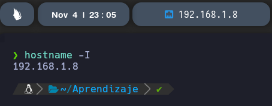
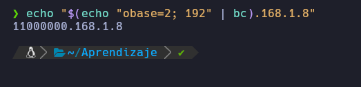

# Direcciones IP (IPV4 e IPv6)

## Comando Hostname
Con este comando podemos ver la IP que tiene nuestra maquina.
```
hostname -I
```

---
## Representación en binario
Se esta representando el numero 192 en Binario
```
echo "$(echo "obase=2; 192" | bc).168.1.8"
```

