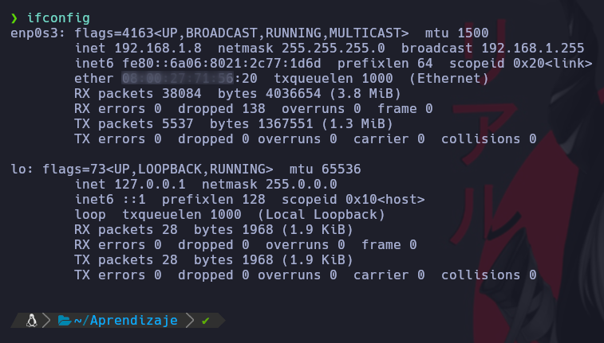

# Direcciones MAC (OUI y NIC)

La dirección MAC es un número hexadecimal de 12 dígitos (número binario de 6 bytes), que está representado principalmente por notación hexadecimal de dos puntos.

Los primeros 6 dígitos (digamos 00:40:96) del MAC Address identifican al fabricante, llamado OUI (Identificador Único Organizacional). El Comité de la Autoridad de Registro de IEEE asigna estos prefijos MAC a sus proveedores registrados.

Los seis dígitos más a la derecha representan el controlador de interfaz de red, que es asignado por el fabricante.

Es decir, los primeros 3 bytes (24 bits) representan el fabricante de la tarjeta, y los últimos 3 bytes (24 bits) identifican la tarjeta particular de ese fabricante. Cada grupo de 3 bytes se puede representar con 6 dígitos hexadecimales, formando un número hexadecimal de 12 dígitos que representa la MAC completa.

Para una búsqueda de fabricante utilizando direcciones MAC, se requieren al menos los primeros 3 bytes (6 caracteres) de la dirección MAC. Una de las herramientas que vemos en esta clase para lograr dicho fin es [‘macchanger‘](https://www.kali.org/tools/macchanger/), una herramienta de GNU/Linux para la visualización y manipulación de direcciones MAC.

## Dirección MAC

