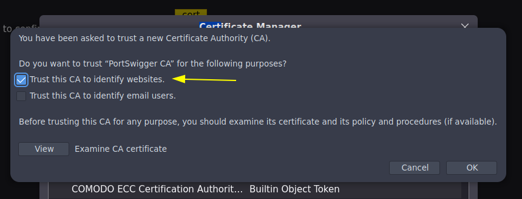

# Fuzzing y enumeración de archivos en un servidor web (1/2)


En esta clase, hacemos uso de las herramientas Wfuzz y Gobuster para aplicar Fuzzing. Esta técnica se utiliza para descubrir rutas y recursos ocultos en un servidor web mediante ataques de fuerza bruta. El objetivo es encontrar recursos ocultos que podrían ser utilizados por atacantes malintencionados para obtener acceso no autorizado al servidor.

Wfuzz es una herramienta de descubrimiento de contenido y una herramienta de inyección de datos. Básicamente, se utiliza para automatizar los procesos de prueba de vulnerabilidades en aplicaciones web.

Permite realizar ataques de fuerza bruta en parámetros y directorios de una aplicación web para identificar recursos existentes. Una de las ventajas de Wfuzz es que es altamente personalizable y se puede ajustar a diferentes necesidades de pruebas. Algunas de las desventajas de Wfuzz incluyen la necesidad de comprender la sintaxis de sus comandos y que puede ser más lenta en comparación con otras herramientas de descubrimiento de contenido.

Por otro lado, Gobuster es una herramienta de descubrimiento de contenido que también se utiliza para buscar archivos y directorios ocultos en una aplicación web. Al igual que Wfuzz, Gobuster se basa en ataques de fuerza bruta para encontrar archivos y directorios ocultos. Una de las principales ventajas de Gobuster es su velocidad, ya que es conocida por ser una de las herramientas de descubrimiento de contenido más rápidas. También es fácil de usar y su sintaxis es simple. Sin embargo, una desventaja de Gobuster es que puede no ser tan personalizable como Wfuzz.

En resumen, tanto Wfuzz como Gobuster son herramientas útiles para pruebas de vulnerabilidades en aplicaciones web, pero tienen diferencias en su enfoque y características. La elección de una u otra dependerá de tus necesidades y preferencias personales.

A continuación, te proporcionamos el enlace a estas herramientas:

* Wfuzz: [https://github.com/xmendez/wfuzz](https://github.com/xmendez/wfuzz)
* Gobuster: [https://github.com/OJ/gobuster](https://github.com/OJ/gobuster)

## Enumerar directorios de una pagina web

### Gobuster

Parametro -u colocamos la URL\
Parametro -w colocamos la lista\
Parametro -t 200 implementa hilos


Parametro --add-slash añade un barra / al final de la ruta para que aparesca que esta haciendo redirección


Para quitar los que contengan codigo estado 403,404 se usa:

Parametro -b 403,404


Con el parametro -x podremos indicarle que los archivos terminen en la extension ejemplo: php,html,js etc...


### Wfuzz

Parametro -c colorea la salida\
Parametro --hc=403,404 quita estos resultados del output\
Parametro -t 200 hilos\
Parametro -w lista de fuzzing\
URL con la palabra reservada FUZZ


Parametro que muestra por cantidad de lineas

Parametro --sl=216


Parametro -z list,html-txt-php   #Aca debemos colocar todas las extensiones que queremos probar a buscar separados por -\
Tener en cuenta que para ".FUZ2Z" si hay otros parametros incrementar el numero


### ffuf

Accedemos a la carpeta /opt y clonamos el repositorio


Procedemos a compilar la herramienta 
el comando du hace que el archivo pese menos de igual forma el upx hace que pese menos

```
sudo go build -ldflags "-s -w" .
sudo du -hc ffuf
sudo upx ffuf

```


Parametro -c lo colorea\
Parametro -t 200 aplica 200 hilos\
Paraetro -w coloca el diccionario a usar\
Parametro -u de URL\
Parametro --mc=200 que me muestre solo los que tengan estado 200


### Burpsuite

Correr la herramienta 

```
burpsuite &> /dev/null & disown
```

Configurar el Plugin en el navegador y guardamos los cambios


Ya tenemos la opción que configuramos


Configurar un certificado SSL de burpsute

Con el plugin corriendo vamos a la pagina web. DESCARGAR el certificado donde dice **CA Certificate**


Una vez descargado vamos a configurar el navegador. Filtramos por Certificates


Importamos el Certificado lo buscamos y lo instalamos


Marcar esta opción



En esta clase, veremos cómo se pueden utilizar diferentes parámetros de Wfuzz para ajustar el alcance y la profundidad de nuestro reconocimiento en aplicaciones web. Algunos de los parámetros que cubriremos incluyen el parámetro ‘–sl‘, para filtrar por un número de líneas determinado, el parámetro ‘–hl‘ para ocultar un número de líneas determinado y por último el parámetro ‘-z‘ para indicar el tipo de dato que queremos usar de cara al reconocimiento que nos interese aplicar, abarcando opciones como diccionarios, listas y rangos numéricos.

Adicionalmente, otra de las herramientas que examinamos en esta clase, perfecta para la enumeración de recursos disponibles en una plataforma en línea, es BurpSuite. BurpSuite es una plataforma que integra características especializadas para realizar pruebas de penetración en aplicaciones web. Una de sus particularidades es la función de análisis de páginas en línea, empleada para identificar y enumerar los recursos accesibles en una página web.

BurpSuite cuenta con dos versiones: una versión gratuita (BurpSuite Community Edition) y una versión de pago (BurpSuite Pofessional).

BurpSuite Community Edition
Es la versión gratuita de esta plataforma, viene incluida por defecto en el sistema operativo. Su función principal es desempeñar el papel de proxy HTTP para la aplicación, facilitando la realización de pruebas de penetración.

Un proxy HTTP es un filtro de contenido de alto rendimiento, ampliamente usado en el hacking con el fin de interceptar el tráfico de red. Esto permite analizar, modificar, aceptar o rechazar todas las solicitudes y respuestas de la aplicación que se esté auditando.

Algunas de las ventajas que la versión gratuita ofrecen son:

Gratuidad: La versión Community Edition es gratuita, lo que la convierte en una opción accesible para principiantes y profesionales con presupuestos limitados.
Herramientas básicas: Incluye las herramientas esenciales para realizar pruebas de penetración en aplicaciones web, como el Proxy, el Repeater y el Sequencer.
Intercepción y modificación de tráfico: Permite interceptar y modificar las solicitudes y respuestas HTTP/HTTPS, facilitando la identificación de vulnerabilidades y la exploración de posibles ataques.
Facilidad de uso: La interfaz de usuario de la Community Edition es intuitiva y fácil de utilizar, lo que facilita su adopción por parte de usuarios con diversos niveles de experiencia.
Aprendizaje y familiarización: La versión gratuita permite a los usuarios aprender y familiarizarse con las funcionalidades y técnicas de pruebas de penetración antes de dar el salto a la versión Professional.
Comunidad de usuarios: La versión Community Edition cuenta con una amplia comunidad de usuarios que comparten sus conocimientos y experiencias en foros y blogs, lo que puede ser de gran ayuda para resolver problemas y aprender nuevas técnicas.
A pesar de que la Community Edition no ofrece todas las funcionalidades y ventajas de la versión Professional, sigue siendo una opción valiosa para aquellos que buscan comenzar en el ámbito de las pruebas de penetración o que necesitan realizar análisis de seguridad básicos sin incurrir en costos adicionales.

BurpSuite Proffesional
BurpSuite Proffessional es la versión de pago desarrollada por la empresa PortSwigger. Incluye, además del proxy HTTP, algunas herramientas de pentesting web como:

Escáner de seguridad automatizado: Permite identificar vulnerabilidades en aplicaciones web de manera rápida y eficiente, lo que ahorra tiempo y esfuerzo.
Integración con otras herramientas: Puede integrarse con otras soluciones de seguridad y entornos de desarrollo para mejorar la eficacia de las pruebas.
Extensibilidad: A través de su API, BurpSuite Professional permite a los usuarios crear y añadir extensiones personalizadas para adaptarse a necesidades específicas.
Actualizaciones frecuentes: La versión profesional recibe actualizaciones periódicas que incluyen nuevas funcionalidades y mejoras de rendimiento.
Soportetécnico: Los usuarios de BurpSuite Professional tienen acceso a un soporte técnico de calidad para resolver dudas y problemas.
Informes personalizables: La herramienta permite generar informes detallados y personalizados sobre las pruebas de penetración y los resultados obtenidos.
Interfaz de usuario intuitiva: La interfaz de BurpSuite Professional es fácil de utilizar y permite a los profesionales de seguridad trabajar de manera eficiente.
Herramientas avanzadas: Incluye funcionalidades avanzadas, como el módulo de intrusión, el rastreador de vulnerabilidades y el generador de payloads, que facilitan la identificación y explotación de vulnerabilidades en aplicaciones web.
En conclusión, tanto la Community Edition como la versión Professional de BurpSuite ofrecen un conjunto de herramientas útiles y eficientes para realizar pruebas de penetración en aplicaciones web. Sin embargo, la versión Professional brinda ventajas adicionales.

La elección entre ambas versiones dependerá del alcance y las necesidades específicas del proyecto o de la empresa. Si se requiere un conjunto básico de herramientas para pruebas de seguridad ocasionales, la Community Edition podría ser suficiente. No obstante, si se busca una solución más completa y personalizable, con soporte técnico y herramientas avanzadas para un enfoque profesional y exhaustivo, la versión Professional sería la opción más adecuada. 


