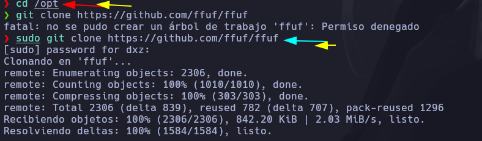

# Fuzzing y enumeración de archivos en un servidor web (1/2)


En esta clase, hacemos uso de las herramientas Wfuzz y Gobuster para aplicar Fuzzing. Esta técnica se utiliza para descubrir rutas y recursos ocultos en un servidor web mediante ataques de fuerza bruta. El objetivo es encontrar recursos ocultos que podrían ser utilizados por atacantes malintencionados para obtener acceso no autorizado al servidor.

Wfuzz es una herramienta de descubrimiento de contenido y una herramienta de inyección de datos. Básicamente, se utiliza para automatizar los procesos de prueba de vulnerabilidades en aplicaciones web.

Permite realizar ataques de fuerza bruta en parámetros y directorios de una aplicación web para identificar recursos existentes. Una de las ventajas de Wfuzz es que es altamente personalizable y se puede ajustar a diferentes necesidades de pruebas. Algunas de las desventajas de Wfuzz incluyen la necesidad de comprender la sintaxis de sus comandos y que puede ser más lenta en comparación con otras herramientas de descubrimiento de contenido.

Por otro lado, Gobuster es una herramienta de descubrimiento de contenido que también se utiliza para buscar archivos y directorios ocultos en una aplicación web. Al igual que Wfuzz, Gobuster se basa en ataques de fuerza bruta para encontrar archivos y directorios ocultos. Una de las principales ventajas de Gobuster es su velocidad, ya que es conocida por ser una de las herramientas de descubrimiento de contenido más rápidas. También es fácil de usar y su sintaxis es simple. Sin embargo, una desventaja de Gobuster es que puede no ser tan personalizable como Wfuzz.

En resumen, tanto Wfuzz como Gobuster son herramientas útiles para pruebas de vulnerabilidades en aplicaciones web, pero tienen diferencias en su enfoque y características. La elección de una u otra dependerá de tus necesidades y preferencias personales.

A continuación, te proporcionamos el enlace a estas herramientas:

* Wfuzz: [https://github.com/xmendez/wfuzz](https://github.com/xmendez/wfuzz)
* Gobuster: [https://github.com/OJ/gobuster](https://github.com/OJ/gobuster)

## Enumerar directorios de una pagina web

### Gobuster

Parametro -u colocamos la URL\
Parametro -w colocamos la lista\
Parametro -t 200 implementa hilos


Parametro --add-slash añade un barra / al final de la ruta para que aparesca que esta haciendo redirección


Para quitar los que contengan codigo estado 403,404 se usa:

Parametro -b 403,404


Con el parametro -x podremos indicarle que los archivos terminen en la extension ejemplo: php,html,js etc...


### Wfuzz

Parametro -c colorea la salida\
Parametro --hc=403,404 quita estos resultados del output\
Parametro -t 200 hilos\
Parametro -w lista de fuzzing\
URL con la palabra reservada FUZZ


Parametro que muestra por cantidad de lineas

Parametro --sl=216


Parametro -z list,html-txt-php   #Aca debemos colocar todas las extensiones que queremos probar a buscar separados por -\
Tener en cuenta que para ".FUZ2Z" si hay otros parametros incrementar el numero


### ffuf

Accedemos a la carpeta /opt y clonamos el repositorio



Procedemos a compilar la herramienta 
el comando du hace que el archivo pese menos de igual forma el upx hace que pese menos

```
sudo go build -ldflags "-s -w" .
sudo du -hc ffuf
sudo upx ffuf

```


Parametro -c lo colorea\
Parametro -t 200 aplica 200 hilos\
Paraetro -w coloca el diccionario a usar\
Parametro -u de URL\
Parametro --mc=200 que me muestre solo los que tengan estado 200


### Burpsuite

Correr la herramienta 

```
burpsuite &> /dev/null & disown
```


