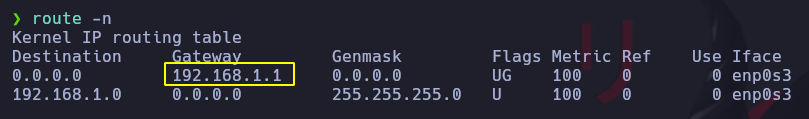

# Nmap y sus diferentes modos de escaneo

Nmap es una herramienta de escaneo de red gratuita y de código abierto que se utiliza en pruebas de penetración (pentesting) para explorar y auditar redes y sistemas informáticos.

Con Nmap, los profesionales de seguridad pueden identificar los hosts conectados a una red, los servicios que se están ejecutando en ellos y las vulnerabilidades que podrían ser explotadas por un atacante. La herramienta es capaz de detectar una amplia gama de dispositivos, incluyendo enrutadores, servidores web, impresoras, cámaras IP, sistemas operativos y otros dispositivos conectados a una red.

Asimismo, esta herramienta posee una variedad de funciones y características avanzadas que permiten a los profesionales de seguridad adaptar la misma a sus necesidades específicas. Estas incluyen técnicas de escaneo agresivas, capacidades de scripting personalizadas, y un conjunto de herramientas auxiliares que pueden ser utilizadas para obtener información adicional sobre los hosts objetivo.

# Descubrir equipos activos

Aplica un barrido con PING para detectar que HOST estan activos. Vamos a aplicar una REGEX o expresion regular para indicarle que nos muestre solo las IP que encuentre.
```
nmap -sn 192.168.1.8/24 | grep -oP '\d{1,3}\.\d{1,3}\.\d{1,3}\.\d{1,3}' | sort 
```

Realizamos un traceroute para averiguar el Gateway nuestro para hacer pruebas con nmap a nuestro Router.


Para escanear un rango de IP colocamos despues de -p el rango
```
nmap -p1-65535 192.168.1.1
```

Otra forma es mediente
```
nmap -p- 192.168.1.1
```

Para mirar los ciertos los X puertos mas comunes. Y que se encuentre abiertos
```
nmap --top-ports 500 --open 192.168.1.1
```

Para quitar la resolucion de nombre de dominio se coloca -n
```
nmap -p- --open 192.168.1.1 -v -n
```

Parametro para hacer un escaneo más rapido -T5 que es plantilla de Temporizado
```
nmap -p- -T5 --open -v -n 192.168.1.1
```

El parametro -Pn indica a nmap que todas las direcciones IP se tomara como que estuvieran activas.
```
nmap -p- -T5 --open -vvv -n -Pn 192.168.1.1
```

Escaneos por UDP
```
nmap -p-p -sU -vvvv -n -Pn 192.168.1.1
```


