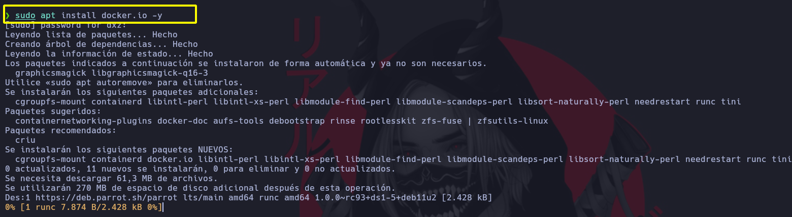

# Instalación de Docker en Linux

Para instalar Docker en Linux, se puede utilizar el comando “apt install docker.io“, que instalará el paquete Docker desde el repositorio de paquetes del sistema operativo. Es importante mencionar que, dependiendo de la distribución de Linux que se esté utilizando, el comando puede variar. Por ejemplo, en algunas distribuciones como CentOS o RHEL se utiliza “yum install docker” en lugar de “apt install docker.io“.

Una vez que Docker ha sido instalado, es necesario iniciar el demonio de Docker para que los contenedores puedan ser creados y administrados. Para iniciar el demonio de Docker, se puede utilizar el comando “service docker start“. Este comando iniciará el servicio del demonio de Docker, que es responsable de gestionar los contenedores y asegurarse de que funcionen correctamente.

Durante la clase, se mostrará cómo verificar que Docker ha sido instalado correctamente, además de comprobar si el demonio de Docker está en ejecución.

```
sudo apt install docker.io -y
```



Correr el servicio de docker

```
service docker start
```


