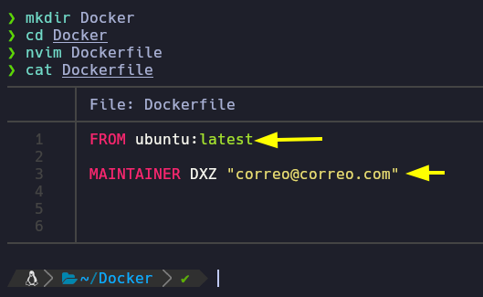

# Definiendo la estructura básica de Dockerfile

Un archivo Dockerfile se compone de varias secciones, cada una de las cuales comienza con una palabra clave en mayúsculas, seguida de uno o más argumentos.

Algunas de las secciones más comunes en un archivo Dockerfile son:

* FROM: se utiliza para especificar la imagen base desde la cual se construirá la nueva imagen.

* RUN: se utiliza para ejecutar comandos en el interior del contenedor, como la instalación de paquetes o la configuración del entorno.

* COPY: se utiliza para copiar archivos desde el sistema host al interior del contenedor.

* CMD: se utiliza para especificar el comando que se ejecutará cuando se arranque el contenedor.

Además de estas secciones, también se pueden incluir otras instrucciones para configurar el entorno, instalar paquetes adicionales, exponer puertos de red y más.

En esta clase, se mostrará cómo crear un archivo Dockerfile desde cero, además de ver cómo utilizar las diferentes secciones y palabras clave para configurar la imagen. En la siguiente clase, veremos cómo construir y ejecutar un contenedor a partir de la imagen creada.

## Estructura de archivo Docker

Creamos un archivo en este caso "Dockerfile" hay debemos escribir todas las configuraciones que debe tener nuestro contenedor. En este caso un linux con la ultima version y datos de quien lo esta creadno o menteniendo.

