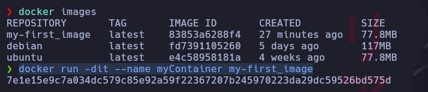
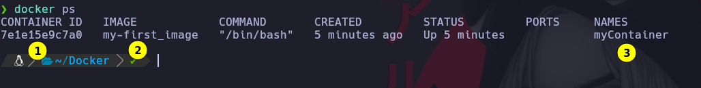
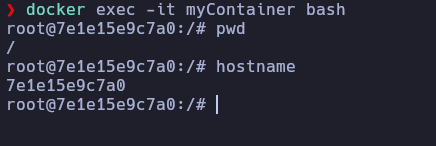
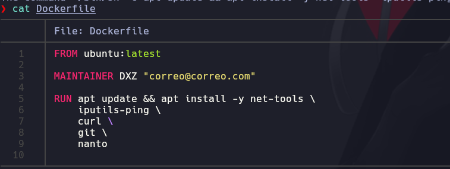
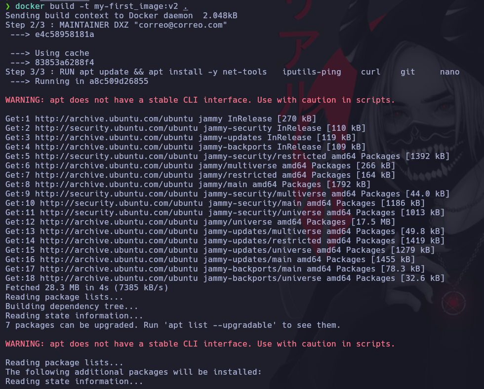
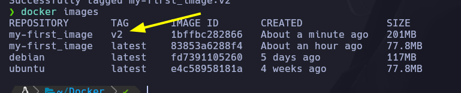
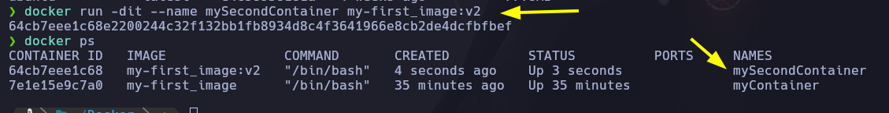

# Carga de instrucciones en Docker y desplegando nuestro primer contenedor

Ya habiendo construido en la clase anterior nuestra primera imagen, ¡ya estamos preparados para desplegar nuestros contenedores!

El comando “docker run” se utiliza para crear y arrancar un contenedor a partir de una imagen. Algunas de las opciones más comunes para el comando “docker run” son:

“-d” o “–detach“: se utiliza para arrancar el contenedor en segundo plano, en lugar de en primer plano.
“-i” o “–interactive“: se utiliza para permitir la entrada interactiva al contenedor.
“-t” o “–tty“: se utiliza para asignar un seudoterminal al contenedor.
“–name“: se utiliza para asignar un nombre al contenedor.
Para arrancar un contenedor a partir de una imagen, se utiliza el siguiente comando:

➜ docker run [opciones] nombre_de_la_imagen

Por ejemplo, si se desea arrancar un contenedor a partir de la imagen “mi_imagen“, en segundo plano y con un seudoterminal asignado, se puede utilizar la siguiente sintaxis:

➜  docker run -dit mi_imagen

Una vez que el contenedor está en ejecución, se puede utilizar el comando “docker ps” para listar los contenedores que están en ejecución en el sistema. Algunas de las opciones más comunes son:

“-a” o “–all“: se utiliza para listar todos los contenedores, incluyendo los contenedores detenidos.
“-q” o “–quiet“: se utiliza para mostrar sólo los identificadores numéricos de los contenedores.
Por ejemplo, si se desea listar todos los contenedores que están en ejecución en el sistema, se puede utilizar la siguiente sintaxis:

➜  docker ps -a

Para ejecutar comandos en un contenedor que ya está en ejecución, se utiliza el comando “docker exec” con diferentes opciones. Algunas de las opciones más comunes son:

“-i” o “–interactive“: se utiliza para permitir la entrada interactiva al contenedor.
“-t” o “–tty“: se utiliza para asignar un seudoterminal al contenedor.
Por ejemplo, si se desea ejecutar el comando “bash” en el contenedor con el identificador “123456789“, se puede utilizar la siguiente sintaxis:

➜ docker exec -it 123456789 bash

En la siguiente clase, veremos algunos de los comandos mayormente usados para la gestión de contenedores.

# Vamos a montar el contenedor con la imagen que creamos

Parametro -d dejar en segundo plano el contenedor\
Parametro -i que sea interactivo\
Parametro -t que disponga de consola virtual\
Parametro --name le colocar una nombre\
Por ultimo es de cual imagen va a crear el contenedor

```
docker run -dit --name myContainer my-first_image
```

Cuando ejecutamos el comando nos crea un identificador



Para ver los contenedores montadors

```
docker ps
```

1) Identificador de contenedor\
2) Imagen la cual se construyo el contenedor\
3) Nombre que le dimoms cunado lo creamos



## Conectar a contenedor

Parametro -i interactive
Parametro -t consola virtual
Parametro bash nos dara una consola de linux

```
docker exec -it myContainer bash
```

Como podemos observar aqui ya estamos dentro de la maquina. Por medio de la bash que le indicamos.



Como no tiene nada instalado vamos a modificar el archivo Dockerfile para indicarle que cuando cree el contenedor nos instale algunos programas



Construimos la imagen con todos los programa que le indicamos



Como podemos observar se creo la imagen v2



Vamos montar y correr el contenedor




