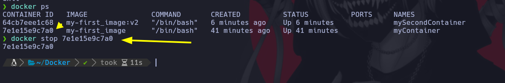
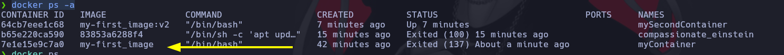
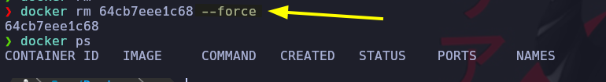
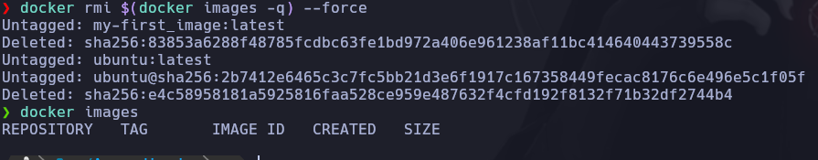

# Comandos comunes para la gestión de contenedores

A continuación, se detallan algunos de los comandos vistos en esta clase:

* docker rm $(docker ps -a -q) –force: este comando se utiliza para eliminar todos los contenedores en el sistema, incluyendo los contenedores detenidos. La opción “-q” se utiliza para mostrar sólo los identificadores numéricos de los contenedores, y la opción “–force” se utiliza para forzar la eliminación de los contenedores que están en ejecución. Es importante tener en cuenta que la eliminación de todos los contenedores en el sistema puede ser peligrosa, ya que puede borrar accidentalmente contenedores importantes o datos importantes. Por lo tanto, se recomienda tener precaución al utilizar este comando.

* docker rm id_contenedor: este comando se utiliza para eliminar un contenedor específico a partir de su identificador. Es importante tener en cuenta que la eliminación de un contenedor eliminará también cualquier cambio que se haya realizado dentro del contenedor, como la instalación de paquetes o la modificación de archivos.

* docker rmi $(docker images -q): este comando se utiliza para eliminar todas las imágenes de Docker en el sistema. La opción “-q” se utiliza para mostrar sólo los identificadores numéricos de las imágenes. Es importante tener en cuenta que la eliminación de todas las imágenes de Docker en el sistema puede ser peligrosa, ya que puede borrar accidentalmente imágenes importantes o datos importantes. Por lo tanto, se recomienda tener precaución al utilizar este comando.

* docker rmi id_imagen: este comando se utiliza para eliminar una imagen específica a partir de su identificador. Es importante tener en cuenta que la eliminación de una imagen eliminará también cualquier contenedor que se haya creado a partir de esa imagen. Si se desea eliminar una imagen que tiene contenedores en ejecución, se deben detener primero los contenedores y luego eliminar la imagen.

En la siguiente clase, veremos cómo aplicar port fowarding y cómo jugar con monturas. El port forwarding nos permitirá redirigir el tráfico de red desde un puerto específico en el host a un puerto específico en el contenedor, lo que nos permitirá acceder a los servicios que se ejecutan dentro del contenedor desde el exterior.

Las monturas, por otro lado, nos permitirán compartir un directorio o archivo entre el sistema host y el contenedor, lo que nos permitirá persistir la información entre ejecuciones de contenedores y compartir datos entre diferentes contenedores.

## Detener un contenedor

```
docker stop ID
```



## Ver todos los contenedores hasta los detenidos 

Como podemos observar aqui aparece el contenedor que detuvimos con el mismo ID podremos volveer a correrlo.

```
docker ps -a
```



## Borrar el contenedor

Borra el contenedor de forma forzada pasandole el ID

```
docker rm "ID" --force
```



### Borrar TODOS los contenedores Montados

```
docker rm $(docker ps -a -q) --force
```

## Borrar imagenes

Borrar 1 imagen, le Pasamos el ID. Toca tener en cuenta que la imagen no DEPENDA de otra.

```
docker rmi ID
```

## Borrar todas las imagenes

```
docker rmi $(docker images -q) --force
```




