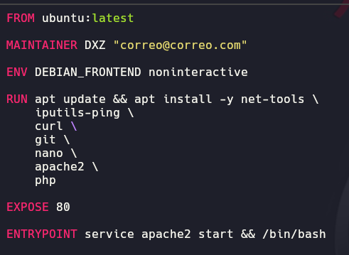
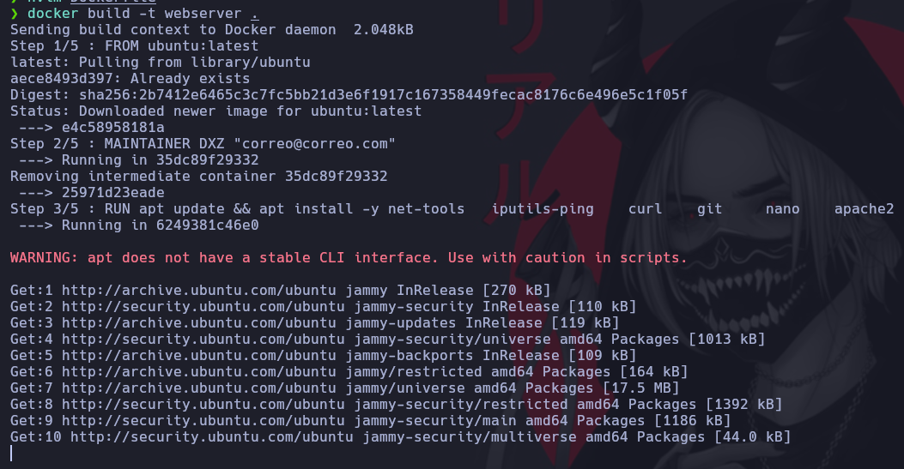

# Port Forwarding en Docker y uso de monturas

El port forwarding, también conocido como reenvío de puertos, nos permite redirigir el tráfico de red desde un puerto específico en el host a un puerto específico en el contenedor. Esto nos permitirá acceder a los servicios que se ejecutan dentro del contenedor desde el exterior.

Para utilizar el port forwarding, se utiliza la opción “-p” o “–publish” en el comando “docker run“. Esta opción se utiliza para especificar la redirección de puertos y se puede utilizar de varias maneras. Por ejemplo, si se desea redirigir el puerto 80 del host al puerto 8080 del contenedor, se puede utilizar la siguiente sintaxis:

➜ docker run -p 80:8080 mi_imagen

Esto redirigirá cualquier tráfico entrante en el puerto 80 del host al puerto 8080 del contenedor. Si se desea especificar un protocolo diferente al protocolo TCP predeterminado, se puede utilizar la opción “-p” con un formato diferente. Por ejemplo, si se desea redirigir el puerto 53 del host al puerto 53 del contenedor utilizando el protocolo UDP, se puede utilizar la siguiente sintaxis:

➜ docker run -p 53:53/udp mi_imagen

Las monturas, por otro lado, nos permiten compartir un directorio o archivo entre el sistema host y el contenedor. Esto nos permitirá persistir la información entre ejecuciones de contenedores y compartir datos entre diferentes contenedores.

Para utilizar las monturas, se utiliza la opción “-v” o “–volume” en el comando “docker run“. Esta opción se utiliza para especificar la montura y se puede utilizar de varias maneras. Por ejemplo, si se desea montar el directorio “/home/usuario/datos” del host en el directorio “/datos” del contenedor, se puede utilizar la siguiente sintaxis:

➜ docker run -v /home/usuario/datos:/datos mi_imagen

Esto montará el directorio “/home/usuario/datos” del host en el directorio “/datos” del contenedor. Si se desea especificar una opción adicional, como la de montar el directorio en modo de solo lectura, se puede utilizar la opción “-v” con un formato diferente. Por ejemplo, si se desea montar el directorio en modo de solo lectura, se puede utilizar la siguiente sintaxis:

➜ docker run -v /home/usuario/datos:/datos:ro mi_imagen

En la siguiente clase, veremos cómo desplegar máquinas vulnerables usando Docker-Compose.

Docker Compose es una herramienta de orquestación de contenedores que permite definir y ejecutar aplicaciones multi-contenedor de manera fácil y eficiente. Con Docker Compose, podemos describir los diferentes servicios que componen nuestra aplicación en un archivo YAML y, a continuación, utilizar un solo comando para ejecutar y gestionar todos estos servicios de manera coordinada.

En otras palabras, Docker Compose nos permite definir y configurar múltiples contenedores en un solo archivo YAML, lo que simplifica la gestión y la coordinación de múltiples contenedores en una sola aplicación. Esto es especialmente útil para aplicaciones complejas que requieren la interacción de varios servicios diferentes, ya que Docker Compose permite definir y configurar fácilmente la conexión y la comunicación entre estos servicios.

# Instalar Apache y Php

Le indicamos que queremos instalar tambien apache y php.\

**ENV** Le indicamos que no queremos que pregunte nada al instalar
**EXPOSE** Le indica a docker que exponga el puerto 80\ 
**ENTRYPOINT** Le indica a Docker cuales son los comandos a ejecutar apenas inicia Docker. En este caso que arranque el servicio de apache



Al construir la imagen nos arrojo error. Donde dice <None>



En esta ocacion filtramos por todas las que aparezcan con <none> con "dangling=true" obtenemos el identificador de todas y procedemos a borrar.

```
docker rmi $(docker images --filter "dangling=true" -q)
```


Con el comando -p80:80 le indicamos a Docker que queremos que el puerto 80 sea igual al nuestro


