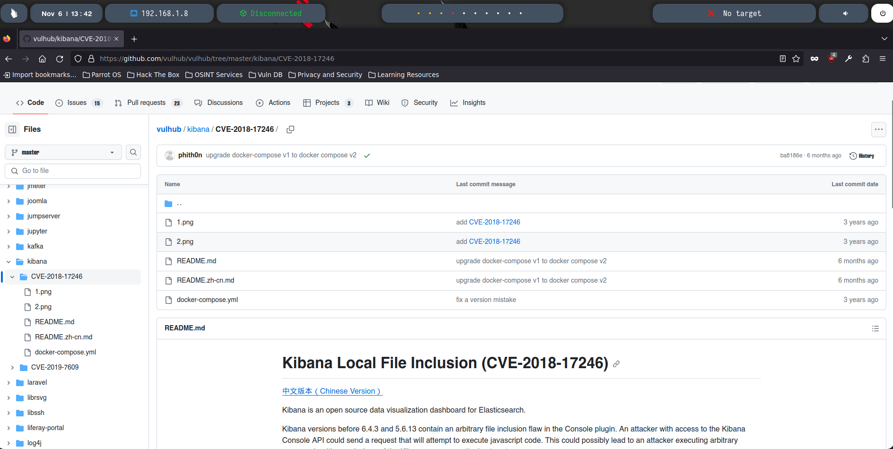
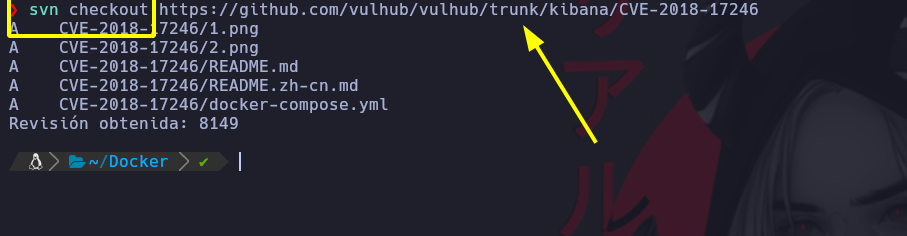

# Despliegue de máquinas vulnerables con Docker-Compose (1/2)

AVISO: En caso de que veáis que no estáis pudiendo instalar ‘nano‘ o alguna utilidad en el contenedor, eliminad todo el contenido del archivo ‘/etc/apt/sources.list‘ existente en el CONTENEDOR y metedle esta línea:

deb http://archive.debian.org/debian/ jessie contrib main non-free
Posteriormente, haced un ‘apt update‘ y probad a instalar nuevamente la herramienta que queráis, ya no os debería de dar problemas.

Si estáis enfrentando dificultades con el contenedor de Elasticsearch y notáis que el contenedor no se crea después de ejecutar ‘docker-compose up -d‘, intentad modificar un parámetro del sistema con el siguiente comando en la consola:

sudo sysctl -w vm.max_map_count=262144‘.
Después de hacerlo, intentad de nuevo ejecutar ‘docker-compose up -d‘, se debería solucionar el problema.

A continuación, os proporcionamos el enlace al proyecto de Github que estamos usando para esta clase:

* Vulhub: [https://github.com/vulhub/vulhub](https://github.com/vulhub/vulhub)
Asimismo, por aquí os compartimos el enlace al recurso donde se nos ofrece el script en Javascript encargado de establecer la Reverse Shell:

* NodeJS Reverse Shell: [https://github.com/appsecco/vulnerable-apps/tree/master/node-reverse-shell](https://github.com/appsecco/vulnerable-apps/tree/master/node-reverse-shell)



## Clonar subcarpeta de Vulhub

Debemos borrar desde donde dice tree/master y colocar trunk.



## Instalar Docker-Compose

Ejecutamos el comando en el orden siguiente

```
sudo curl -L https://github.com/docker/compose/releases/download/1.22.0/docker-compose-`uname -s`-`uname -m` -o /usr/local/bin/docker-compose
sudo chmod +x /usr/local/bin/docker-compose
docker-compose --version
```


