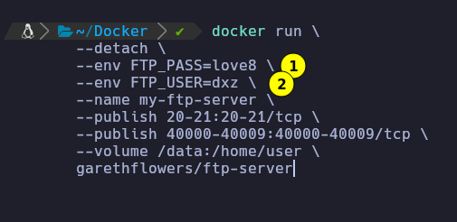
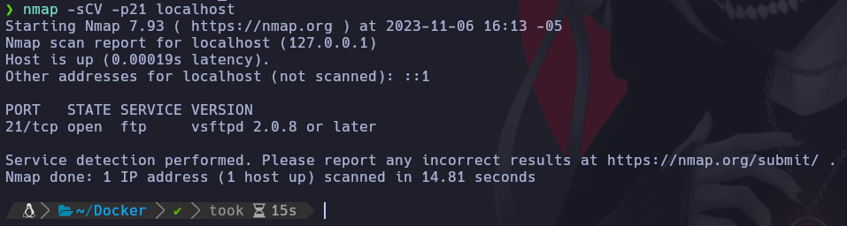
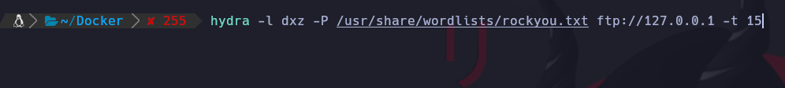

# Enumeración del servicio FTP

En esta clase, hablaremos sobre el protocolo de transferencia de archivos (FTP) y cómo aplicar reconocimiento sobre este para recopilar información.

FTP es un protocolo ampliamente utilizado para la transferencia de archivos en redes. La enumeración del servicio FTP implica recopilar información relevante, como la versión del servidor FTP, la configuración de permisos de archivos, los usuarios y las contraseñas (mediante ataques de fuerza bruta o guessing), entre otros.

A continuación, se os proporciona el enlace al primer proyecto que tocamos en esta clase:

* Docker-FTP-Server: [https://github.com/garethflowers/docker-ftp-server](https://github.com/garethflowers/docker-ftp-server)

Una de las herramientas que usamos en esta clase para el primer proyecto que nos descargamos es ‘Hydra‘. Hydra es una herramienta de pruebas de penetración de código abierto que se utiliza para realizar ataques de fuerza bruta contra sistemas y servicios protegidos por contraseña. La herramienta es altamente personalizable y admite una amplia gama de protocolos de red, como HTTP, FTP, SSH, Telnet, SMTP, entre otros.

El siguiente de los proyectos que utilizamos para desplegar el contenedor que permite la autenticación de usuarios invitados para FTP, es el proyecto ‘docker-anon-ftp‘ de ‘metabrainz‘. A continuación, se os proporciona el enlace al proyecto:

* Docker-ANON-FTP: [https://github.com/metabrainz/docker-anon-ftp](https://github.com/metabrainz/docker-anon-ftp)

# Configuración de Docker-FTP-Server

Colocamos una contraseña del RockYou que esta en. Y el usuario

```
cat /usr/share/wordlists/rockyou.txt
```



Le das enter y empiza la descarga e instalación. Si hacemos un docker ps. Vemos que el contenero ya se encuentra ejecutandose.

## Reconocimiento Nmap

Vamos a realizar un escaneo al puerto 21 con alguos scripts para que nos arroje mas información.

```
nmap -sCV -p21 127.0.0.1
```



Suponiendo que conocemos el usuario vamos a hacer un ataque de fuerza bruta de Diccionario con hydra.

* Parametro -l es cuando conocemos el usuario. -L cuando queremos ingresar un diccionario de posibles usuarios.
* Parametro -P para hacer un ataque por diccionario al password.
* Parametro -t 15 hilos




