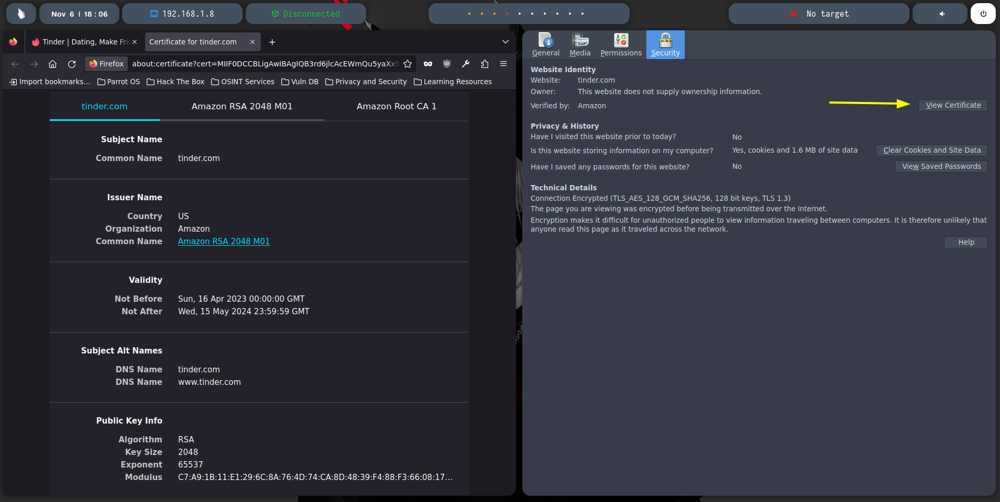
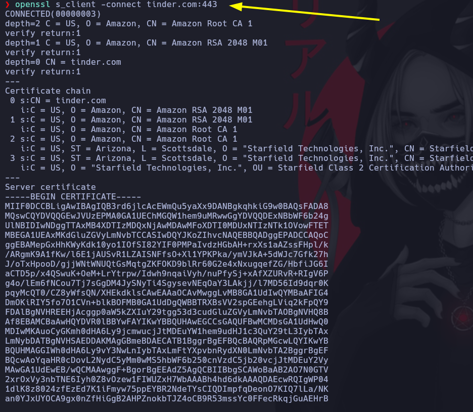
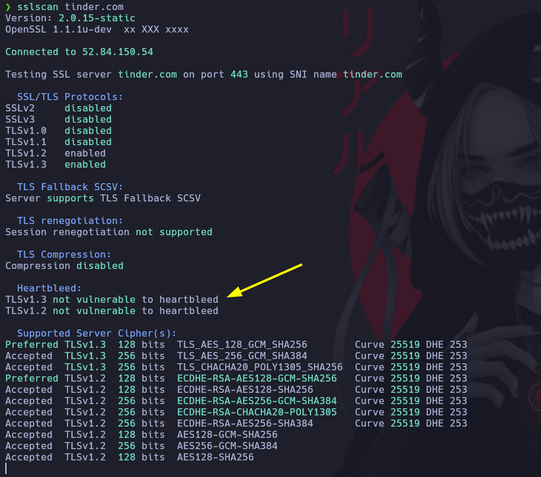
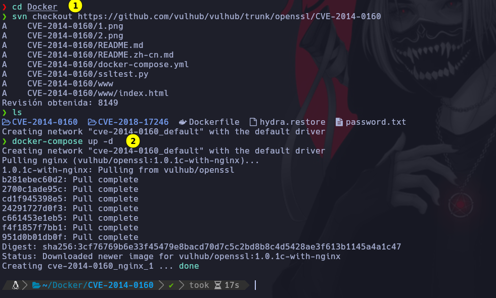
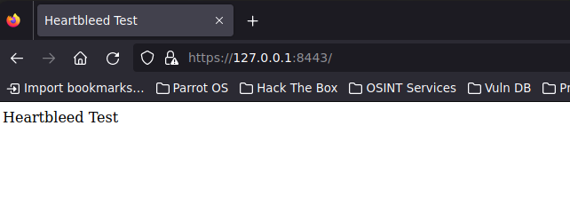
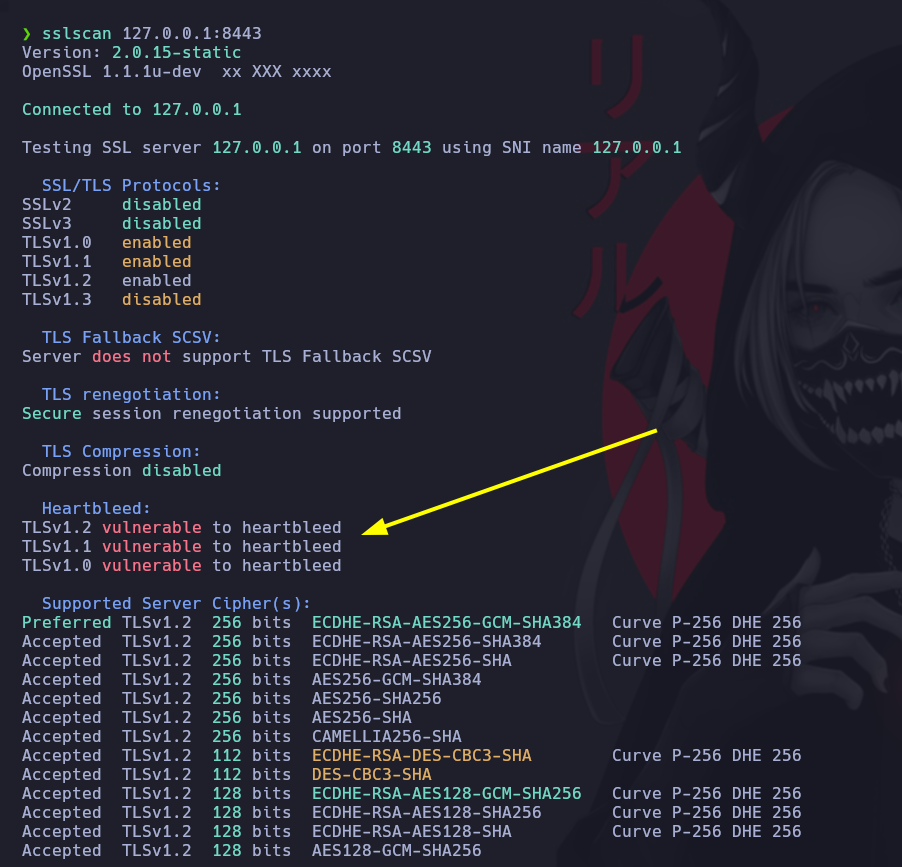
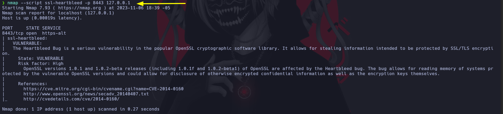

# Enumeración del servicio HTTP y HTTPS

HTTP (Hypertext Transfer Protocol) es un protocolo de comunicación utilizado para la transferencia de datos en la World Wide Web. Se utiliza para la transferencia de contenido de texto, imágenes, videos, hipervínculos, etc. El puerto predeterminado para HTTP es el puerto 80.

HTTPS (Hypertext Transfer Protocol Secure) es una versión segura de HTTP que utiliza SSL / TLS para cifrar la comunicación entre el cliente y el servidor. Utiliza el puerto 443 por defecto. La principal diferencia entre HTTP y HTTPS es que HTTPS utiliza una capa de seguridad adicional para cifrar los datos, lo que los hace más seguros para la transferencia.

Una de las herramientas que vemos en esta clase para inspeccionar el certificado SSL es ‘Openssl‘. OpenSSL es una biblioteca de software libre y de código abierto que se utiliza para implementar protocolos de seguridad en línea, como TLS (Transport Layer Security), SSL (Secure Sockets Layer). La biblioteca OpenSSL proporciona una implementación de estos protocolos para permitir que las aplicaciones se comuniquen de manera segura y encriptada a través de la red.

Uno de los comandos que vemos en esta clase haciendo uso de esta herramienta es el siguiente:

➜ openssl s_client -connect ejemplo.com:443

Con este comando, podemos inspeccionar el certificado SSL de un servidor web. El comando se conecta al servidor en el puerto 443 y muestra información detallada sobre el certificado SSL, como la validez del certificado, la fecha de caducidad, el tipo de cifrado, etc.

Asimismo, otras de las herramientas que vemos en esta clase son ‘sslyze‘ y ‘sslscan‘. Sslyze es una herramienta de análisis de seguridad SSL que se utiliza para evaluar la configuración SSL de un servidor. Proporciona información detallada sobre el cifrado utilizado, los protocolos admitidos y los certificados SSL. SSLScan es otra herramienta de análisis de seguridad SSL que se utiliza para evaluar la configuración SSL de un servidor. Proporciona información detallada sobre los protocolos SSL / TLS admitidos, el cifrado utilizado y los certificados SSL.

La principal diferencia entre sslyze y sslscan es que sslyze se enfoca en la evaluación de la seguridad SSL/TLS de un servidor web mediante una exploración exhaustiva de los protocolos y configuraciones SSL/TLS, mientras que sslscan se enfoca en la identificación de los protocolos SSL/TLS admitidos por el servidor y los cifrados utilizados.

La identificación de las informaciones arrojadas por las herramientas de análisis SSL/TLS es de suma importancia, ya que nos puede permitir detectar vulnerabilidades en la configuración de un servidor y tomar medidas para proteger nuestra información confidencial.

Por ejemplo, Heartbleed es una vulnerabilidad de seguridad que afecta a la biblioteca OpenSSL y permite a los atacantes acceder a la memoria de un servidor vulnerable. Si un servidor web es vulnerable a Heartbleed y lo detectamos a través de estas herramientas, esto significa que un atacante podría potencialmente acceder a información confidencial, como claves privadas, nombres de usuario y contraseñas, etc.

A continuación, se proporciona el enlace al proyecto de Github donde desplegamos el laboratorio vulnerable a Heartbleed:

* CVE-2014-0160: [https://github.com/vulhub/vulhub/tree/master/openssl/CVE-2014-0160](https://github.com/vulhub/vulhub/tree/master/openssl/CVE-2014-0160)

# Inspeccionar el certificado SSL 



Podemos inspeccionar los certificados SSL de la pagina web, posiblemente se encuentre información util.\
Como por ejemplo, subdominios, correos etc..

```
openssl s_client -connect tinder.com:443
```



# Herramienta SSLSCAN

Nos permite inspeccionar el certificado en busqueda de vulnerabilidades.
En esta ocación no es vulnerable a heartbleed



# Docker Vulnerable Heartblled

Con el comando svn checkout descargamos la carpeta.

```
svn checkout REPOSITOPIO #Recoardar hacer el truco del TRUNK
```

Ingresamos a la carpeta para compilar el proyecto y verificamos con docker ps

```
docker-compose up -d
```



El contenedor esta corriendo por el puerto 8443

```
https://127.0.0.1:8443/
```



Volvemos a realizar un scaeno del certificado SSL a esta maquina y nos arroja que es vulnerable to heartbleed



NMAP tiene un script para mirar si el certificado es vulnerable a hertbleed. Lo podemos buscar la siguiente forma.

```
locate .nse | grep heartbleed
```

Para ejecutar el script de nmap usamos

```
nmap --script ssl-heartbleed -p 8443 127.0.0.1
```




