# Reverse Shells, Bind Shells y Forward Shells

En esta clase, veremos las diferencias entre Reverse Shell, Bind Shell y Forward Shell:

* Reverse Shell: Es una técnica que permite a un atacante conectarse a una máquina remota desde una máquina de su propiedad. Es decir, se establece una conexión desde la máquina comprometida hacia la máquina del atacante. Esto se logra ejecutando un programa malicioso o una instrucción específica en la máquina remota que establece la conexión de vuelta hacia la máquina del atacante, permitiéndole tomar el control de la máquina remota.

* Bind Shell: Esta técnica es el opuesto de la Reverse Shell, ya que en lugar de que la máquina comprometida se conecte a la máquina del atacante, es el atacante quien se conecta a la máquina comprometida. El atacante escucha en un puerto determinado y la máquina comprometida acepta la conexión entrante en ese puerto. El atacante luego tiene acceso por consola a la máquina comprometida, lo que le permite tomar el control de la misma.

* Forward Shell: Esta técnica se utiliza cuando no se pueden establecer conexiones Reverse o Bind debido a reglas de Firewall implementadas en la red. Se logra mediante el uso de mkfifo, que crea un archivo FIFO (named pipe), que se utiliza como una especie de “consola simulada” interactiva a través de la cual el atacante puede operar en la máquina remota. En lugar de establecer una conexión directa, el atacante redirige el tráfico a través del archivo FIFO, lo que permite la comunicación bidireccional con la máquina remota.
Es importante entender las diferencias entre estas técnicas para poder determinar cuál es la mejor opción en función del escenario de ataque y las limitaciones de la red.

# Creando Docker

Vamos a crear un contenedor para realizar las pruebas de Shell

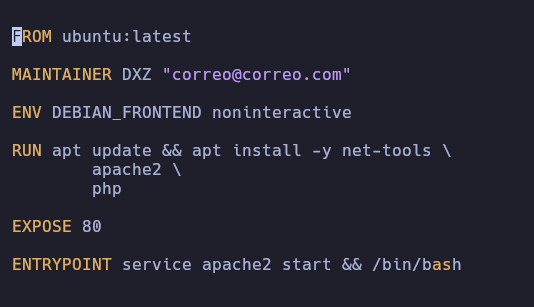

Construimos la imagen con el comando 

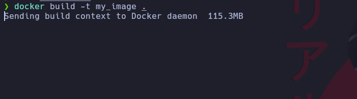

Vemos que nos creo la maquina con docker images.\
Vamos a correr la imagen que corra en segundo plano, consola virtual y modo interactivo.\
Le indicamos que mi puerto 80 sea igual al puerto 80 del contenedor.\
Le damos un nombre al contenedor en este caso myContainer\
Y por ultimo como se llama la imagen que creamos

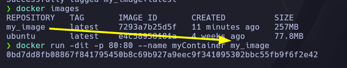

# Reverse Shell

Vamos a ingresar al contenedor por consola por medio del comando. Simulando que encontramos la manera de poder ejecutar comandos.

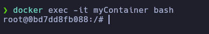

Relizamos un netcat para quedar en escucha esperando una conexion del servidor.

Parametro -n no aplicar resolucion DNS\
Parametro -l para colocarse en escucha\
Parametro -v verbose\
Parametro -p para el puerto

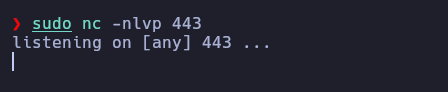

Simulando que pudimos ejecutar comandos. Realizamos la conexión a nuestro netcat que esta en escuah 

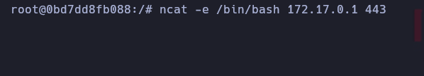

Como podemos ver se entablo una reserve shell y podemos ejecutar el comando desde nuestro netcat

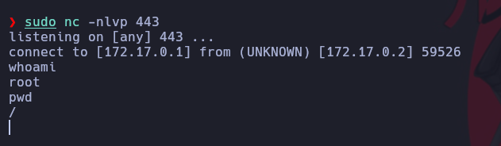

# Bind Shell

En este caso desde el servidor estamos ofreciendo una Bash por el puerto 443 esperando a que el usuario se conecte.


Y desde la maquina local nos conectamos al servidor

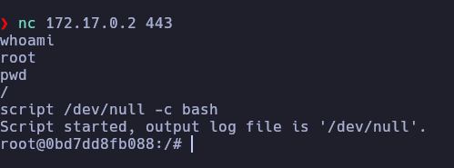

# Forward Shells

Vamos a instalar iptables en el contenedor para colocar reglas de firewall

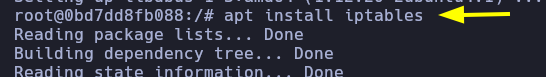

Tambien instalaremos algunas cosas de php para que funcione

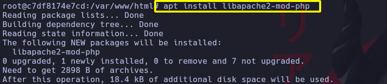

Reiniciamos el servicio de apache

```
service apache2 restart
```

Para poder ejecutar el contenedor con una flag para poder ejecutar las iptables debemos detener el servicio de docker.\
Debemos eliminar el contenedor tambien.

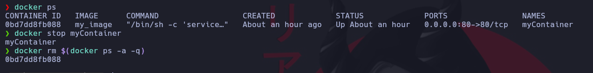

Ahora corremos el contenedor con la nueva flag para poder ejecutar las iptables

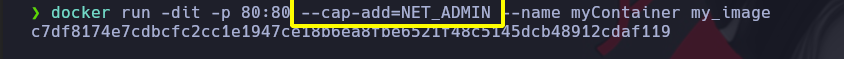

Volvemos a instalar las iptables.

Le indicamos que tocas las peticiones TCP por el puerto 80 sean aceptadas las demas seran bloqueadas.

Debemos modificar la ruta 
Buscamos en nano con Ctrl + w y buscamos short_open_tag y lo pasamos a Off

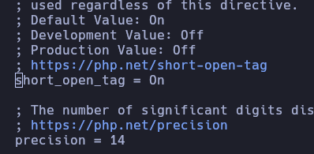

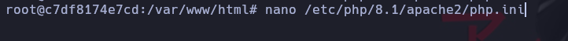

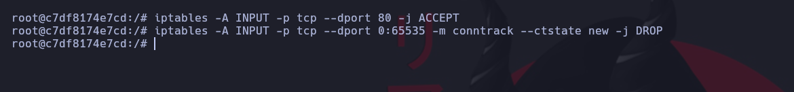

Borramos el index.html del servidor\
Supondremos que pudimos subir un archivo .php al servidor en la ruta /var/www/html en este caso se llamarada cmd.php

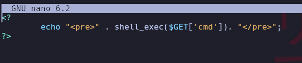

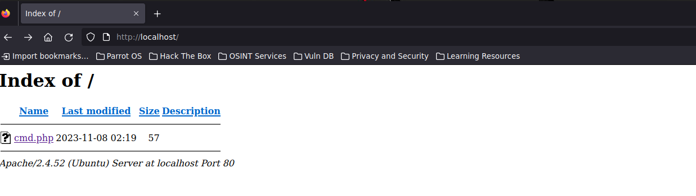


