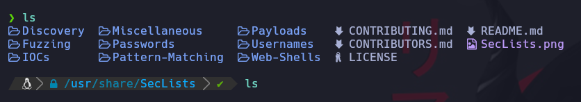

# Listado de Academia
En esta ocación estoy sacando apuntes sobre la Academia de S4vitar para tener los conceptos más claros e investigar al respecto.

# Instalación de SecList

Repositorio para ataque de fuerza bruta.
Clonamos el repo en la ruta: **/usr/share/**

[SecList](https://github.com/danielmiessler/SecLists)

[01 Conceptos Básicos](https://github.com/sacrabma92/CiberSecurity/tree/main/03_Academia/01%20Conceptos%20Basicos)
[02 Reconocimiento](https://github.com/sacrabma92/CiberSecurity/tree/main/03_Academia/02_Reconocimiento)
